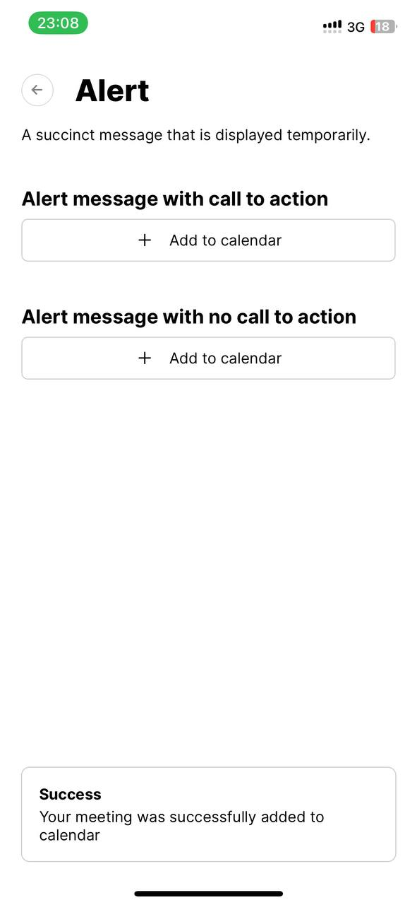

# expo-ui
A repo dump for my reusable UI components across different apps, design inspiration from Vercel's design system and shadcn ui


<strong>
<h3>This is still a work in progress! :)</h3>
</strong>

<br />

## Technologies Used
<li>React Native Expo</li>
<li>Typescript</li>

## Getting Started

### Prerequisites
Either download the Expo Go app to run this app locally on your physical device or set up an emulator with Expo Go installed on it. [Read more on how to do this here.](https://docs.expo.dev/?utm_source=google&utm_medium=cpc&utm_content=search&gclid=CjwKCAjwt52mBhB5EiwA05YKo9ApcV0tDCvRc2lLjmf4kEnshwrvWzpUCQLDWf4sgSq5jG3gGiRhRxoCjUcQAvD_BwE)

To run the app locally, follow these steps:

1. Clone this repository and navigate into the project
   ```sh
   git clone https://github.com/nklmantey/expo-ui-nklmantey.git
   cd expo-ui-nklmantey
   ```
2. Install necessary packages and dependencies
   ```sh
   npm install
   ```
3. Run the app
   ```sh
   npx expo start
   ```

## Screenshots
<details>
	<summary>View screenshots</summary>
<p align="left">
  
  
  
  
  
  
  
  
</p>
</details>
